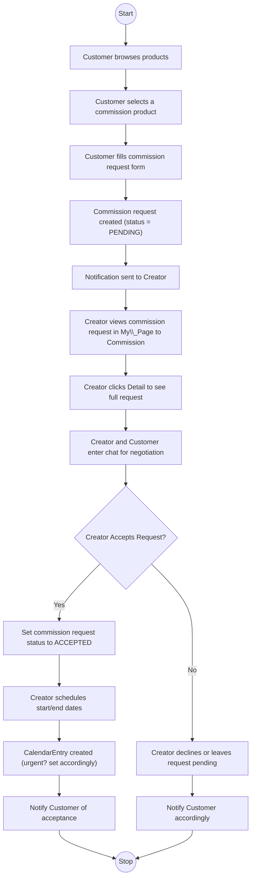

```mermaid
flowchart TD
    start(("Start"))
    A["Customer browses products"]
    B["Customer selects a commission product"]
    C["Customer fills commission request form"]
    D["Commission request created (status = PENDING)"]
    E["Notification sent to Creator"]
    F["Creator views commission request in My\\_Page to Commission"]
    G["Creator clicks Detail to see full request"]
    H["Creator and Customer enter chat for negotiation"]
    decision{"Creator Accepts Request?"}
    I["Set commission request status to ACCEPTED"]
    J["Creator schedules start/end dates"]
    K["CalendarEntry created (urgent? set accordingly)"]
    L["Notify Customer of acceptance"]
    M["Creator declines or leaves request pending"]
    N["Notify Customer accordingly"]
    stop(("Stop"))
    
    start --> A
    A --> B
    B --> C
    C --> D
    D --> E
    E --> F
    F --> G
    G --> H
    H --> decision
    decision -- Yes --> I
    I --> J
    J --> K
    K --> L
    L --> stop
    decision -- No --> M
    M --> N
    N --> stop
```