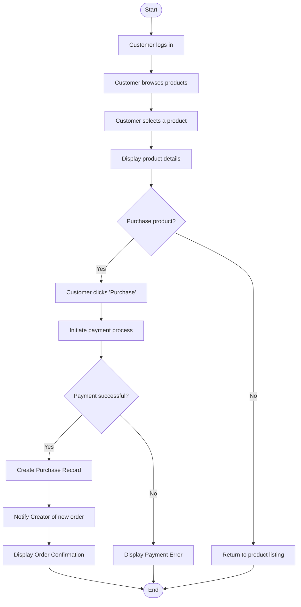

```mermaid
flowchart TD
    Start([Start])
    A[Customer logs in]
    B[Customer browses products]
    C[Customer selects a product]
    D[Display product details]
    E{Purchase product?}
    F[Customer clicks 'Purchase']
    G[Initiate payment process]
    H{Payment successful?}
    I[Create Purchase Record]
    J[Notify Creator of new order]
    K[Display Order Confirmation]
    L[Display Payment Error]
    M[Return to product listing]
    End([End])
    
    Start --> A
    A --> B
    B --> C
    C --> D
    D --> E
    E -- Yes --> F
    E -- No --> M
    F --> G
    G --> H
    H -- Yes --> I
    H -- No --> L
    I --> J
    J --> K
    K --> End
    L --> End
    M --> End


```