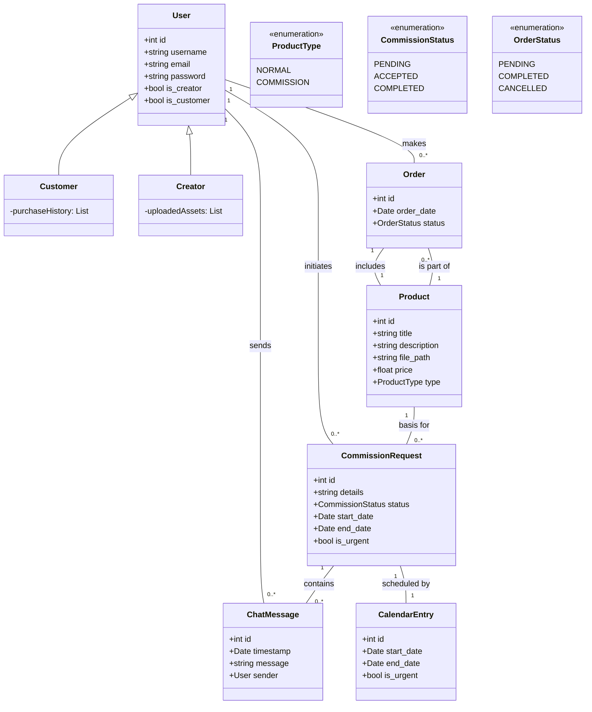

```mermaid
classDiagram
    class User {
      +int id
      +string username
      +string email
      +string password
      +bool is_creator
      +bool is_customer
    }

    class Customer {
      -purchaseHistory: List<Purchase>
    }
    class Creator {
      -uploadedAssets: List<Asset>
    }

    User <|-- Customer
    User <|-- Creator

    class Product {
      +int id
      +string title
      +string description
      +string file_path
      +float price
      +ProductType type
    }
    
    class CommissionRequest {
      +int id
      +string details
      +CommissionStatus status
      +Date start_date
      +Date end_date
      +bool is_urgent
    }

    class Order {
      +int id
      +Date order_date
      +OrderStatus status
    }
    
    class ChatMessage {
      +int id
      +Date timestamp
      +string message
      +User sender
    }
    
    class CalendarEntry {
      +int id
      +Date start_date
      +Date end_date
      +bool is_urgent
    }
    
    class ProductType {
      <<enumeration>>
      NORMAL
      COMMISSION
    }
    
    class CommissionStatus {
      <<enumeration>>
      PENDING
      ACCEPTED
      COMPLETED
    }
    
    class OrderStatus {
      <<enumeration>>
      PENDING
      COMPLETED
      CANCELLED
    }
    
    User "1" -- "0..*" Order : makes
    User "1" -- "0..*" CommissionRequest : initiates
    User "1" -- "0..*" ChatMessage : sends
    Product "1" -- "0..*" Order : is part of
    Product "1" -- "0..*" CommissionRequest : basis for
    CommissionRequest "1" -- "0..*" ChatMessage : contains
    CommissionRequest "1" -- "1" CalendarEntry : scheduled by
    Order "1" -- "1" Product : includes


```