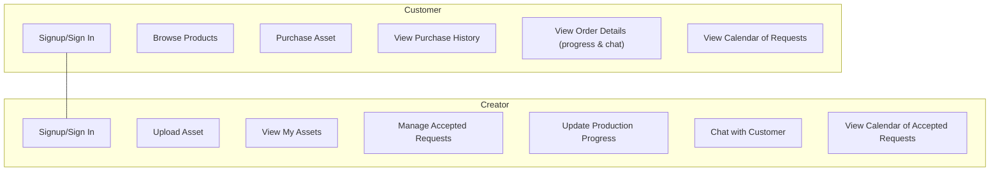

```mermaid
flowchart TD
    subgraph Customer
        A[Signup/Sign In]
        B[Browse Products]
        C[Purchase Asset]
        D[View Purchase History]
        E["View Order Details (progress & chat)"]
        F[View Calendar of Requests]
    end

    subgraph Creator
        G[Signup/Sign In]
        H[Upload Asset]
        I[View My Assets]
        J[Manage Accepted Requests]
        K[Update Production Progress]
        L[Chat with Customer]
        M[View Calendar of Accepted Requests]
    end

    %% Optional connections if you want to emphasize shared use cases:
    A --- G


```