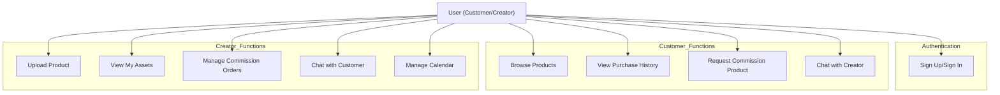

```mermaid
flowchart TD
    subgraph Authentication
        A[Sign Up/Sign In]
    end

    subgraph Customer_Functions
        B[Browse Products]
        C[View Purchase History]
        D[Request Commission Product]
        E[Chat with Creator]
    end

    subgraph Creator_Functions
        F[Upload Product]
        G[View My Assets]
        H[Manage Commission Orders]
        I[Chat with Customer]
        J[Manage Calendar]
    end

    U["User (Customer/Creator)"]
    U --> A
    U --> B
    U --> C
    U --> D
    U --> E
    U --> F
    U --> G
    U --> H
    U --> I
    U --> J


```