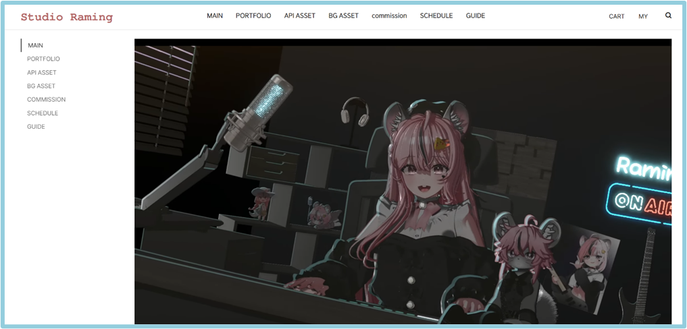

# V-hub 


## Link
- Studio Raming: https://studioraming.com/
- V-hub_Domain: https://www.v-hub.store/
- GITHUB: https://github.com/zeberity123/v_hub_web.git

## 프로젝트 개요
- 파편화된 플랫폼
- 현재 3D에셋 판매 플랫폼(예시:BOOTH)과 에셋을 활용한 외주 제작 플랫폼(예시:아트머그) 실제 연락을 주고받는 메신저(예시:디스코드 혹은 메일 등)가 나뉘어져 있어 기술자와 의뢰자들이 서로 소통하는데 불편을 겪고 있음

- 구매자가 다른 플랫폼에서 구매한 상품을 개조/활용하는 작업을 작가(판매자)에게 의뢰할 경우 저작권 문제로 인하여 판매자 또한 구매하여야 한다는 조항이 있는데 이를 서로 확인하기 어려워 직접 작가와 구매자가 직접 구매자의 구매내역을 비교하면서 소통해야 하는 등 불필요한 시간소요가 자주 발생함

- 실제 결제가 이루어지는 외주 제작 플랫폼과 실질적인 견적을 산출하기 위해 소통하는 메신저가 분리되어 있어 기술자와 의뢰자의 상호 소통이 외주 플랫폼 내에서 매끄럽게 이루어지기 어려움

- 작가(판매자) 측에서의 주문 관리와 고객관리 또한 매우 불편함

- 거래 진행의 불투명성
- 개인 프리랜서로 활동하는 경우, 모든 작업 일정 관리를 개인 작업자 본인이 직접 시행하여야 하고, 작업 중간 과정 공유와 의뢰자와의 소통 또한 한 명씩 진행할 수밖에 없음

- 금액을 지불하고 의뢰를 맡긴 의뢰자 입장에서 의뢰의 실제 진행 정도 확인, 정확한 작업물의 수정과 마감 일정 확인 등이 어려움. 프로젝트의 진행의 지연 등의 문제가 생겼을 때, 보상 요청도 이루어지기 어려움

## 프로젝트 목표
- 버추얼 아바타 제작의뢰와 디지털 에셋 판매를 하나의 플랫폼으로,
버추얼 제작자와 의뢰인을 연결하고, 원활한 의뢰 진행을 도움
- 개인 버추얼 제작자를 위한 최적의 플랫폼

-	고객관리, 일정관리, 견적생성, 상담 업무까지 하나의 서비스로 제공
-	제작자와 의뢰자의 개인 정보를 상호 보호 제작하여 판매하는 디지털 에셋의 지적 재산권 보호

## Requirements
- Python
- Django
- NextJS
- npm
- (npx)

## Installation
Download the latest version from [here](https://github.com/zeberity123/v_hub_web.git).

## How to run (Backend)
```
pip install -r requirements.txt
cd v_hub_web/backend
python manage.py makemigrations
python manage.py migrate
python manage.py runserver
```
**On your web browser**: http://localhost:8000

## How to run (Frontend)
```
pip install -r requirements.txt
cd v_hub_web/frontend
npm run dev
```
**On your web browser**: http://localhost:3000

## Progress
1. ~~요구사항 분석(생략)~~ **<-UML과 동시진행**
    - ~~프로젝트의 목적과 요구사항을 이해합니다.~~
    - ~~사용자의 요구사항과 기대하는 기능을 파악합니다.~~
2. 디자인 단계
    - UI/UX 디자인을 수행합니다.
    - 디자인 시안을 작성하고 필요한 요소들을 정의합니다.
3. ~~기술 스택 선택~~  **<- Django, NextJS(react)**
    - ~~개발에 사용할 기술 스택을 선택합니다.~~
    - ~~프로젝트의 목적, 요구사항, 개발 환경 등을 고려하여 선택합니다.~~
4. *아키텍처 설계(플로우 차트 작성)* **<-UML(class, activity, flow, usecase)작성중**
    - *시스템 아키텍처를 설계합니다.*
    - *컴포넌트 구조, 데이터 흐름, 서버와의 인터페이스 등을 정의합니다.*
5. 프로토타이핑
    - 프로젝트의 초기 버전을 만듭니다.
    - 개발 방향성을 검증하고 프로젝트를 이해하는 데 도움을 줍니다.
6. 개발 단계
    - 프론트엔드 개발 (1-1로 이동)
    - 백엔드 개발 (1-2로 이동)
    - 디자인과 아키텍처 설계에 기반하여 실제 개발을 진행합니다.
    - 코드의 품질을 유지하고, 테스트를 수행하며 문제를 해결합니다.
7. 테스트 단계
    - 기능 및 UI/UX 테스트를 수행합니다.
    - 버그를 찾고 수정합니다.
8. 배포 단계
    - 개발이 완료된 소프트웨어를 배포합니다.
    - 프로덕션 환경에서 사용될 수 있도록 프로세스를 따릅니다.
## 1-1 프론트엔드 개발 진행 순서
1. **NextJS**를 이용해 웹사이트 구조 및 컴포넌트 작성 : 메인 페이지, 상품 목록, 상세 페이지, 장바구니, 결제 페이지 등을 구현합니다.
2. CSS 및 디자인 작업 : 반응형 웹 디자인, 애니메이션 등을 적용합니다.
3. API 연동 : 백엔드와 통신하기 위한 API 호출 작성을 진행합니다.
## 1-2 백엔드 개발 진행 순서(Python 개발, Docker 배포 가정)
1. DB 설계 **<- 현재SQlite,  AWS 서버 이용시 mySQL 예정**
    - 데이터 요구사항 확인
    - 개념적 설계: 개체간 관계 파악 및 ER 다이어그램 작성 **<- on work**
    - DBMS 선택
    - 논리적 설계: 데이터 모델링
    - 물리적 설계: ORM 테스트
2. API 명세 작성
    - RESTful API 준수 **<-Django Restframework 사용**
    - 기능별 내용, app, endpoint, 파라미터, HTTP method 정리
3. ~~개발환경 세팅~~ **<-초기 가상환경 세팅**
    - ~~Python 가상환경 생성~~
    - ~~dev/prod 환경 분리~~
    - ~~비밀값 관리~~
4. 서버 구축 **AWS S3 예정(대용량) 예산따라 변경**
    - 서버 구조 설계 및 다이어그램 작성
    - DB 서버 설정 및 연동
    - DBMS 생성 및 연동
    - SFTP 설정 및 연동
    - Docker 이미지 생성
5. 배포
    - Docker 컨테이너 실행
    - 웹 서버 - 앱 서버 - 앱 연동
    - 도메인 등록
    - HTTPS 설정
6. API
    - MVC 패턴 기능 구현 **<- Django는 MVT**
    - 로깅 및 에러 추적
    - 캐싱
    - 비동기
    - API 문서화
7. DB 관리
    - 백업
    - 쿼리 최적화
    - 트랜잭션
    - DB 인덱싱
8. 성능 최적화
    - 멀티 프로세싱
    - 멀티 스레딩

## Resources
- https://velog.io/@jmk445/%EC%9B%B9-%EA%B0%9C%EB%B0%9C-%ED%94%84%EB%A1%9C%EC%84%B8%EC%8A%A4
- https://github.com/adamchainz/django-cors-headers
- https://radial-fighter-931.notion.site/Data-Engineering-31cf63ff9ce040b59b50c61fbcb7d4ce
- https://nerogarret.tistory.com/48
- https://rob-coding.tistory.com/5
- https://github.com/wodnrP/Chat_Project
- https://velog.io/@dltmdgus9661/Django-%EC%9B%B9%ED%8E%98%EC%9D%B4%EC%A7%80-%EB%A7%8C%EB%93%A4%EA%B8%B03-HTML%EA%B3%BC-Static